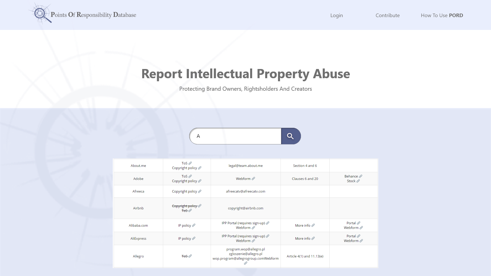

 # Points of Responsibility Database

  
  

## See the deployed app here: https://put name here.herokuapp.com/

    # Table of Contents

* [Description](#description)
* [User Story](#user-story)
* [Installation](#what-command-should-be-run-to-install-dependencies)
* [Usage](#what-does-the-user-need-to-know-about-using-the-repo)
* [Contributors](#contributors-to-this-project)
* [Contributing](#what-does-the-user-need-to-know-about-contributing-to-this-repo)
* [Testing](#what-command-should-be-run-to-run-tests)
* [License](#what-license-is-the-application-covered-under)
* [Questions](#questions)
* [Demonstration](#demonstration)
    

## Description:
    An app that makes the task of reporting intellectual property abuse easy.

## User Story:
    As a person who wants to report intellectual property abuse needs to know where to report. This database mades it easy to find points of responsibility.

## What command should be run to install dependencies?
    npm i

## What does the user need to know about using the repo?
    nothing

## Contributors to this Project:
    Rachel Moore, Melanie Stuart, Maria Byler, Matt Hinegardner, Michael Hill

## What does the user need to know about contributing to this repo?
    nothing

## What command should be run to run tests?
    none

## What license is the application covered under?
    none

## Questions:
For questions about the PORDB, visit the GitHub page:
    https://github.com/MStuart90/Point-of-Responsibility-Database

## Demonstration:
  
  ## You may also contact team members via email at:
  Rachel Moore: rachelmoore6822@gmail.com,
  Michael Hill: mike@digitalamnesia.io,
  Maria Byler: mariabyler98@gmail.com,
  Melanie Stuart: mmooradian90@yahoo.com,

  
  ## License:
  Click on the link to find information about the license
  [License](https://opensource.org/licenses/)
